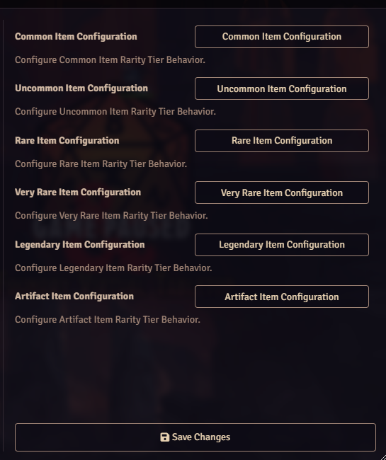
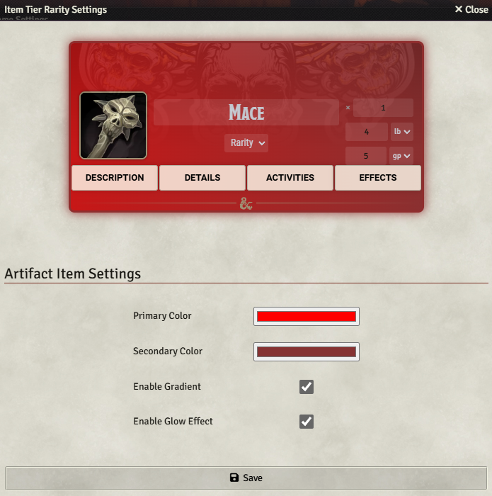
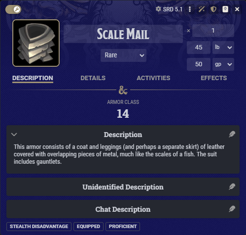
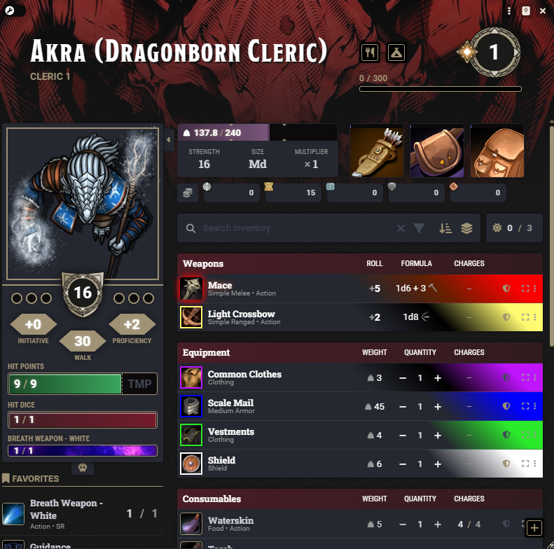

# ⚔️ SC - Item Rarity Colors

Enhance your D&D 5e item sheets with **SC - Item Rarity Colors** 🎨  
Each item rarity can have its own color, optional gradient for higher rarities, and glowing effect for Legendary and Artifact gear.  
Make magical items *visually stand out* in your players' inventories.

[🧩 Request features or report issues](https://github.com/Shattered-Codex/sc-item-rarity-colors/issues)

---

## 🧭 Installation

1. In Foundry’s **Add-on Modules → Install Module**, paste:
   `https://github.com/Shattered-Codex/sc-item-rarity-colors/releases/latest/download/module.json`
2. Install and enable **SC - Item Rarity Colors** in your world’s module list.

> 🧠 Compatible with **Foundry VTT v13+** and **dnd5e** system.

---

## ⚡ Quick Start

1. Open any **item sheet** (weapon, armor, magic item).  
2. Set the **Rarity** field (Common, Uncommon, Rare, Very Rare, Legendary, Artifact).  
3. The sheet background updates automatically:
- **Common, Uncommon, Rare** → single color  
- **Very Rare, Legendary, Artifact** → optional gradient  
- **Legendary, Artifact** → optional glowing effect  
4. Open the respective rarity tier config form in **Module Settings** to see a live preview.

---

## ✨ Features

- 🎨 **Per-Rarity Colors** – each rarity has its own color picker  
- 🌈 **Optional Gradients** – blend two colors for higher tiers  
- 💫 **Glowing Effects** – highlight Legendary and Artifact items  
- ⚙️ **Fully Configurable** – tweak colors, gradients, and glow  
- 👁️ **Live Preview** – instant visual feedback while adjusting  
- 🔄 **Auto Update** – changes apply instantly to open item sheets  

---

## ⚙️ Module Settings

Found under **Configure Settings → Module Settings → SC - Item Rarity Colors**:

| Rarity | Options |
|:--------|:---------|
| Common | Base Color |
| Uncommon | Base Color |
| Rare | Base Color |
| Very Rare | Base Color, optional **Enable Gradient** → Secondary Color |
| Legendary | Base Color, optional **Enable Gradient** → Secondary Color, optional **Glow** |
| Artifact | Base Color, optional **Enable Gradient** → Secondary Color, optional **Glow** |

---

## 🧩 Usage Notes

- Gradients are **optional** and available for Very Rare, Legendary, and Artifact tiers  
- Glow is **optional** and only available for Legendary and Artifact tiers  
- The configuration form provides **real-time preview** of your settings  
- All changes are **applied instantly** to open sheets and previews  

---

## 💡 Example Look

| View | Screenshot |
|:------|:------------|
| Configuration Menu |  |
| Rarity Tier Config Form |  |
| Item Sheet |  |
| Player Sheet |  |

### 🌈 Glow & Gradient Live Preview

  
  
  

---

## 🛠️ Credits

Created with 💛 by **Shattered Codex**  
Inspired by the desire to make loot feel *just as magical as it is powerful*.

---
